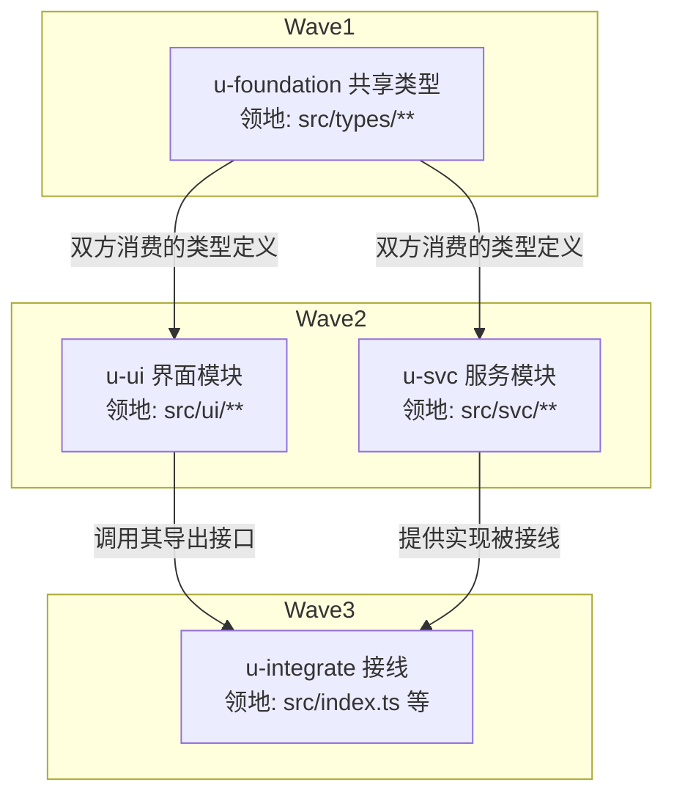

# DAG 编写规范

> 服务 `flow/plan.md` 阶段 1。回答四个问题：单元怎么切、边怎么连、worktree 何时开、图怎么画。

## 单元切分判据

- 单个 dev subagent 可独立完成：规模 ≤5 文件 / ~3000 行（与全局 subagent 约束一致）
- 验收条款客观可判：命令能跑、输出可比、效果可见
- 领地可枚举到精确文件路径；枚不出来的单元 = 拆分不成熟，继续拆
- **共享接线点集中律**：被多个单元消费的类型/接口/契约模块 → 独立设为 `u-foundation` 根节点，串行先行。禁止并行单元同时编辑共享契约文件

## 边的判定

| 关系 | 结论 |
|------|------|
| 先写后读 / 接口复用 / 同文件共改 | 串行边 |
| 领地互斥且无数据依赖 | 可并行，同时就绪即同批派发 |
| 纯平移/重构场景的跨单元 import 依赖 | 优先经契约先行解除（见下节），解除不了再落串行边 |
| 其余拿不准 | 默认加串行边（保守正确），运行期观察后再松绑 |

拓扑分层即 DAG 展示分组（每层 ≤5 个，兼容并发上限）；执行调度是流式的——单元 committed 即解锁后继补派，不存在整层 barrier。

## 契约先行压扁深链（仅限纯平移/重构）

实测教训（2026-09-09 五会话复盘）：单元边若照搬 import 依赖，关键路径深可达 9 层，每层再叠加主 agent 核验 commit 的调度间隙，就绪集长期只有 1–2 个单元，busy 期平均并发仅 1.0–1.3（上限 5）。拆得更细救不了深链——并行度由最大反链宽度决定，与单元总数无关；粒度切小只会让链更深、每单元固定开销（冷启动读文档 + 核验 commit）占比更高。

- 适用条件（全部满足才可用）：
  - 纯平移/重构：源仓已有测试基线与行为参照，正确性有上游锚点可对照
  - 跨单元依赖是静态 import 关系，不是运行时数据流或共享状态变更顺序
- 做法：
  1. 新增 `u-contracts` 根单元：集中产出全部被跨单元 import 的类型定义 + 函数签名 stub（`throw new Error("stub: u-contracts")` 级即可），自身测试绿
  2. 实现单元改为仅依赖 `u-contracts`，彼此无边 → 全部同时就绪、整批并行派发
  3. 收尾设收口测试单元（依赖全部实现单元）：全量集成测试真实跑绿，充当阶段 2 的出口门
- 验收分级（对「committed 前测试真实跑绿」双锁不变量的场景化松动，仅平移可用，新写代码禁用）：
  - 实现单元：tsc 编译绿 + 测试用例落位——用例真实存在、断言到位；因 stub 无法跑绿的部分逐条列入 deviations 的 stub-blocked 项
  - 收口测试单元：全量测试真实跑绿，不绿不得进入阶段 3；stub-blocked 项在此逐条销账
- 禁止：用契约先行掩盖真正的行为依赖——运行时数据流、初始化顺序、共享可变状态是真串行边，stub 救不了也不许救

## worktree 决策表

满足任一条才开 worktree，否则一律 plain（领地互斥已足够安全，worktree 有建立/合并/清理成本）：

| 条件 | 说明 |
|------|------|
| 触碰热点公共文件 ≥1 | 如全局路由表、index 出口、共享 store——冲突面大 |
| 实验性大改、可能整体废弃 | 失败时直接弃置，不污染工作分支 |
| 用户指定 | 用户要求优先 |

计划表 `隔离` 列必须标注；执行差异见 execute.md「worktree 单元的差异」。

## mermaid 画法

正例（子图分层 + 边带原因 + 领地入节点）：

反例（出现即返工）：

- 假并行：两个单元都改 `src/index.ts` 却画成无边平行——两者会同时就绪、并行派发造成写冲突
- 边不带原因：后续无法审查「这条依赖是否还成立」
- 领地含糊（只写「前端相关」）→ 无法生成 add 白名单与互斥判定
- 无验收条款列 → 执行期验收条款现编，回溯断裂

## 写盘前自检清单

- [ ] 任意两单元领地交集为空
- [ ] 每条边有原因标注
- [ ] u-foundation 存在且为根（确无共享契约时才允许缺席）
- [ ] 每行验收条款独立可判
- [ ] 每层单元数与并发 ≤5 兼容
- [ ] 隔离列与热点文件分析一致
- [ ] 关键路径深度 ≤4，或最大反链宽度 ≥3；两者皆不满足且未走契约先行的，注明「任务本质串行」的原因
- [ ] 纯平移/重构且链深超标时已评估契约先行：适用即设 u-contracts + 收口测试单元，并同步说明双锁不变量的场景化松动
